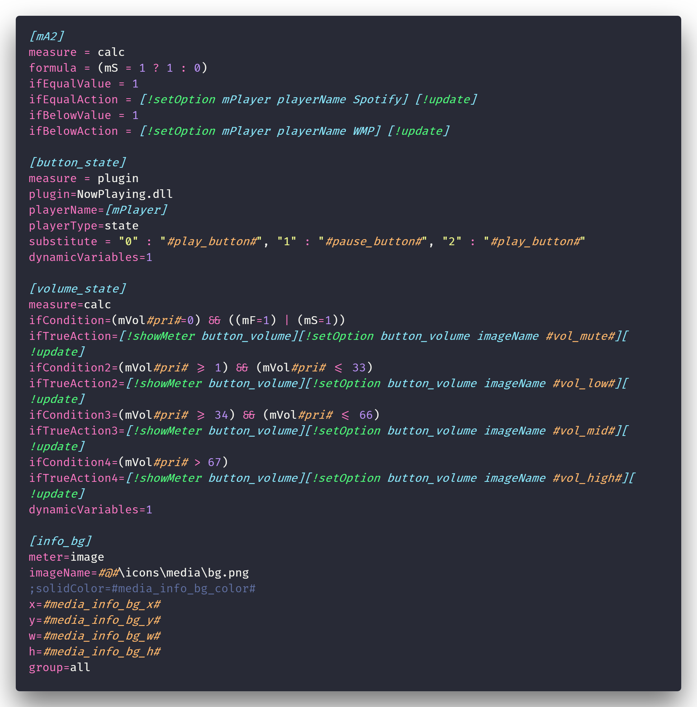
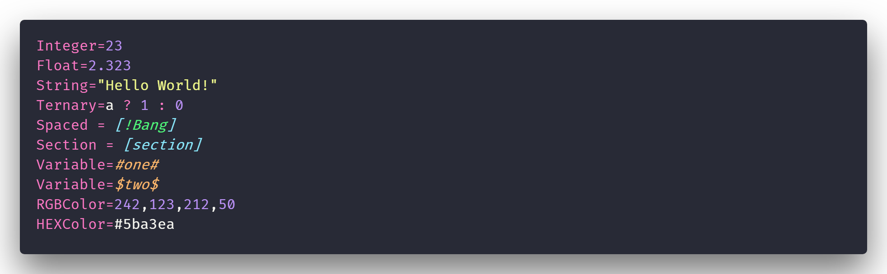

# Rainmeter - Syntax Highlighting for VSCode

## Preview

## Type Examples

The theme used in the demo is 'Dracula Official'

## Snippets

## Features

Since there were no existing Rainmeter extensions for Visual Studio Code, I've created one (pretty basic for now) to help.
Adds syntax highlighting for Rainmeter keywords, bangs, variables, and sections.

## Adds a few snippets for quick creation of:
* Rainmeter section
* Metadata section
* Measures
    - Min/Max Value
    - Generic
    - IfConditions
    - IfAbove/Below/Equal
    - IfMatch Regexp
* Meters
    - Image
    - Generic
* MeterStyles
* SolidColor
    - RGBA
    - HEX

I'll happily add PR's; or ideas/issues when I have time and depending on the content.

[GitHub](https://github.com/will-shaw/ws-rainmeter)

## Release Notes

This version adds basic syntax highlighting for Rainmeter .ini and .inc files.
It also has a small number of snippets to get started.

-----------------------------------------------------------------------------------------------------------

**Hope it helps!**
